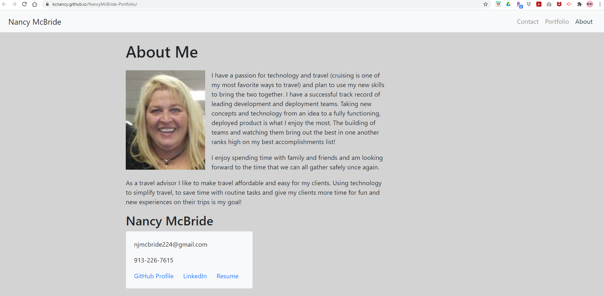
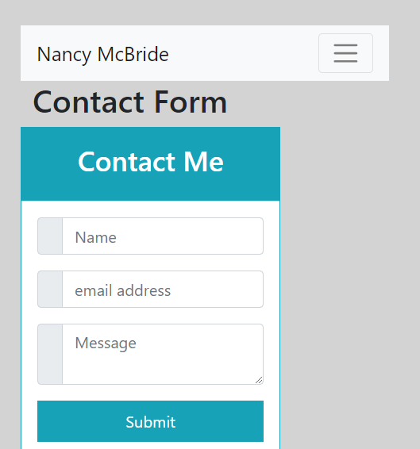
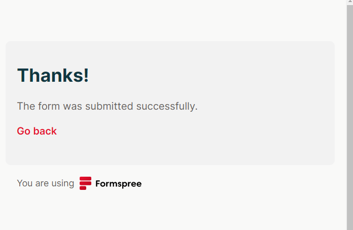
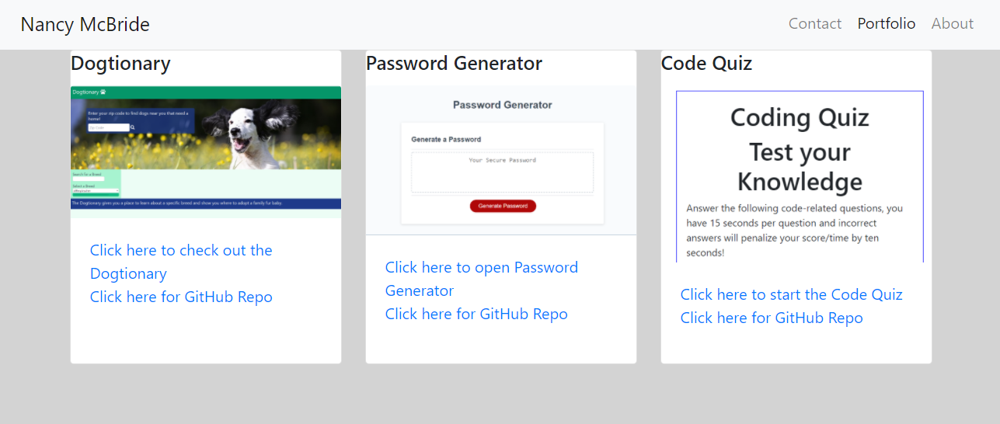

# Nancy McBride 

https://kcnancy.github.io/NancyMcBride-Portfolio/

## Table of Contents
* [Description](#description)
* [User Story](#userstory)
* [Development](#development)
* [Usage](#usage)
* [Tests and Known Issues](#tests-and-known-issues)
* [Future Enhancements](#future-enhancements)
* [Credits](#credits)
* [License](#license)

## Description
This project is to create and maintain my bio and repo website. 

Beginning with index.html I have created a 3 page website that includes an About Me page,
a Contact Me page and a page with references and links to my portfolio (Portfolio page).

All 3 pages have the same navbar header so that you can easily navigate between the pages. The page is responsive and on small screens the navbar offers a hamburger drop down for navigation between pages. 

## User Story
**The updated portfolio shall-**
* Display full name, email and phone number
* Have a link to GitHub profile
* Have a link to LinkedIn profile
* Have a link to downloadable PDF of resume
* Display at least 2 examples of student work, either projects or homework assignments

    **Each project should include -**
    * Project Title
    * Link to deployed version
    * Link to GitHub repository
    * Screenshot of the deployed application
* User interface should be polished and responsive.

## Development
About me (index.html)
For the bio or About Me page, I used Bootstrap and containers to include an image, a brief write up about me and a card with my email, phone number, as well as links to my GitHub profile, LinkedIn profile and a downloadable PDF version of my resume. All of these links when clicked open the selected item in a new window. 

The Contact Form page was completely rebuilt for this version of my Portfolio. 
The navbar functions the same as on the index.html. I used Bootstrap and a small custom css to create my contact me info box. I used Formspree to make the submit button actually send an email.
 

This is what the user sees after successfully sending an email from the contact me form.

The last page is the portfolio page. For this page I restyled my layout using the card deck from Bootstrap.
Each card has an image of the deployed project/assignment as well as 'Click here' links to the Github repo and the deployed webpage.

Final commit before submission corrected the navbar toggle for mobile/small screen view.
